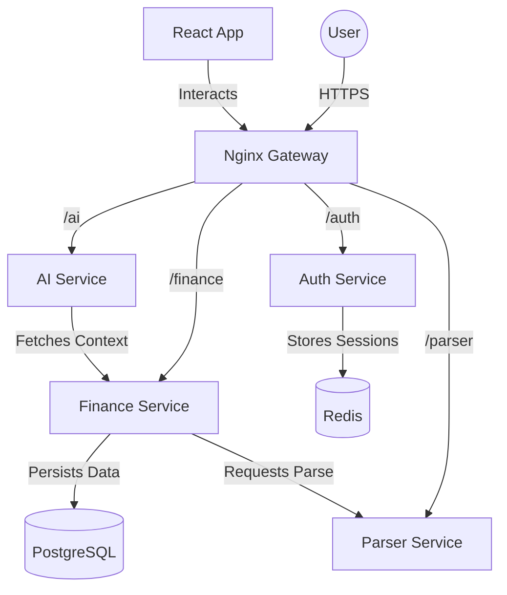

# Spendsy Architecture

This document describes the high-level architecture of the Spendsy platform, its components, and how they interact.

## 📱 Overview

Spendsy is built as a set of distributed microservices that communicate primarily via HTTP APIs, with Redis used for cross-cutting concerns like rate-limiting and session invalidation.

## 🏗️ Components

### 1. Nginx Gateway (`infra/docker/nginx.conf`)
The entry point for all API traffic. It handles:
- Reverse proxying to internal services.
- Path-based routing (`/auth`, `/finance`, etc.).
- Standardizing header injection.

### 2. Auth Service (`spendsy/services/auth-service`)
Responsible for identity management.
- **Tech**: FastAPI, SQLAlchemy, Redis.
- **Features**: JWT issue/refresh, Password hashing (Argon2), IDOR prevention.
- **Security**: Uses HttpOnly cookies to prevent XSS-based token theft.

### 3. Finance Service (`spendsy/services/finance-service`)
The core domain service.
- **Tech**: FastAPI, PostgreSQL.
- **Entities**: Transactions, Wealth Records, User Profiles.
- **Accuracy**: Uses `Decimal` type for all financial calculations to avoid floating-point errors.
- **Performance**: Implements cursor-based pagination for transaction histories.

### 4. Parser Service (`spendsy/services/parser-service`)
Specialized worker service for document processing.
- **Tech**: FastAPI, PDF libraries.
- **Role**: Extracts transaction data from bank statement PDFs.

### 5. AI Service (`spendsy/services/ai-service`)
Intelligence layer.
- **Tech**: FastAPI, LLM integration.
- **Role**: Provides natural language querying of financial data ("How much did I spend on coffee last month?").

### 6. Frontend (`apps/web/frontend`)
Single Page Application (SPA).
- **Tech**: React, Vite, Tailwind CSS.
- **Pattern**: Uses React Query for state management and data fetching.
- **UI**: Premium dark-mode aesthetic with interactive charts.

## 🔒 Security Model

- **Authentication**: Stateless JWT but with a Redis-backed "allow-list/block-list" for instant logout/revocation.
- **Validation**: Strict Pydantic schemas for all API inputs and outputs.
- **Database**: Parameterized queries via SQLAlchemy to prevent SQL injection.
- **Environment**: Sensitive data is managed via `.env` files (not committed to repo).

## 📊 Data Flow

1. **Transaction Upload**: Frontend sends PDF -> Gateway -> Finance Service -> Parser Service.
2. **Analysis**: Finance Service processes data -> PostgreSQL.
3. **Query**: User asks AI -> Gateway -> AI Service -> Finance Service (Internal API) -> AI response.
