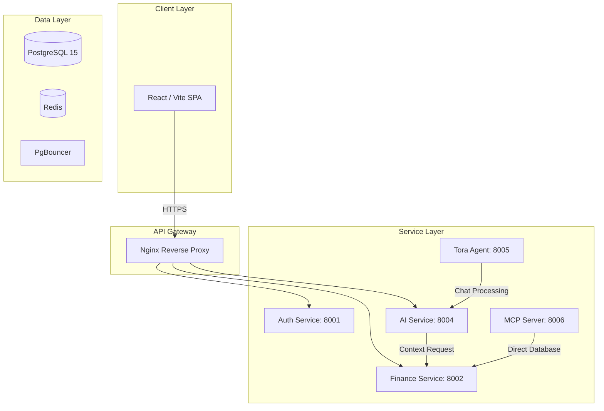

# Software Requirements Specification (SRS) - Spendsy

## 1. Introduction

### 1.1 Purpose
Spendsy is a premium, AI-driven personal finance management (PFM) platform tailored for the Indian market. It automates financial tracking, simplifies tax planning (ITR), monitors wealth across assets and liabilities, and provides intelligent insights through advanced LLM agents.

### 1.2 Document Scope
This document outlines the system architecture, core functionality, technical stack, and security protocols used to build and maintain the Spendsy ecosystem.

---

## 2. System Architecture

Spendsy follows a modern **Microservices Architecture**. Services are decoupled by domain and communicate via high-performance REST APIs.

### 2.1 Component Diagram

---

## 3. Technology Stack

Spendsy leverages cutting-edge technologies to ensure performance, accuracy, and a premium user experience.

### 3.1 Frontend (Presentation Layer)
- **Framework**: React 19 (SPA)
- **Build Tool**: Vite
- **Styling**: Tailwind CSS (with Glassmorphism & Premium Dark Mode)
- **Animations**: Framer Motion
- **State Management**: React Query (TanStack)
- **Icons**: Lucide React
- **Charts**: Recharts

### 3.2 Backend (Service Layer)
- **Language**: Python 3.11+
- **Framework**: FastAPI (Asynchronous execution)
- **ORM**: SQLAlchemy 2.0 (Declarative Base)
- **Validation**: Pydantic v2 (Strict type safety)
- **Concurrency**: Uvicorn + Uvloop
- **Utility Libraries**:
    - `Decimal`: For high-precision financial arithmetic.
    - `Tenacity`: For resilient exponential backoff on retries.
    - `pdfplumber`: For high-accuracy deterministic document parsing.

### 3.3 Intelligence (AI Layer)
- **Core Models**: Google Gemini 1.5 Pro / 2.0 Flash
- **Agent Framework**: Custom Tora Agent (OpenAI/Gemini-powered)
- **Model Context Protocol (MCP)**: Implemented for secure, structured access of LLMs to user financial data.

### 3.4 Infrastructure & Storage
- **Database**: PostgreSQL 15 (Relational storage)
- **Connection Pooling**: PgBouncer (Transaction-mode pooling)
- **Caching**: Redis (Session blacklisting, rate limiting)
- **Gateway**: Nginx (Request routing, SSL termination)
- **Orchestration**: Docker & Docker Compose

---

## 4. Key Features

### 4.1 Automated Financial Tracking
- **Smart Parsing**: High-accuracy deterministic extraction of transactions from digital bank statements (PDF) using word-level coordinate analysis and column detection.
- **Fingerprinting**: SHA-256 based deduplication to prevent double-counting when re-uploading overlapping statements.
- **Real-time Ledger**: Transaction categorization with manual and AI-suggested refinements.

### 4.2 Wealth & Tax Management
- **Asset/Liability Monitoring**: Support for tracking net worth, equity, and debt.
- **ITR Planning**: Support for Indian tax slab calculations (New vs. Old Regime) stored as high-precision JSONB snapshots.

### 4.3 AI Financial Copilot (Tora)
- **Natural Language Querying**: "How much did I spend on Zomato last month?"
- **Financial Planning**: AI-driven recommendations for budgeting and saving.
- **Direct Action**: Tora can programmatically interact with internal finance APIs to create plans or categorize spends.

---

## 5. Security & Data Privacy

### 5.1 Authentication
- **Mechanism**: JWT (JSON Web Tokens) with stateless validation.
- **Storage**: Tokens are stored in **HttpOnly, SameSite=Lax, Secure** cookies to prevent XSS and CSRF.
- **Revocation**: Instant session invalidation via Redis blacklist check on every middleware hop.

### 5.2 Encryption
- **Passwords**: Argon2 encryption (via `passlib`)—the current industry gold standard for hashing.
- **Database**: Parameterized queries via SQLAlchemy to prevent all forms of SQL Injection.
- **Internal APIs**: Service-to-service communication is secured via static API Keys and internal Docker network isolation.

---

## 6. System Requirements (Non-Functional)
- **Availability**: 99.9% targeted through microservice isolation (one service crashing doesn't kill the platform).
- **Scalability**: Stateless services allow for horizontal scaling behind the Nginx gateway.
- **Accuracy**: Absolute financial integrity enforced by Python `Decimal` type across the entire backend.

---
*Created on: 2026-03-18*
*Authored by: Spendsy Architectural Team*
