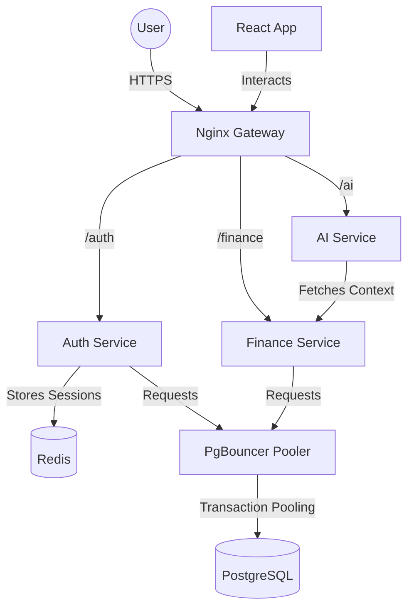

# Spendsy Architecture

This document describes the high-level architecture of the Spendsy platform, its components, and how they interact.

## 📱 Overview

Spendsy is built as a set of distributed microservices that communicate primarily via HTTP APIs, with Redis used for cross-cutting concerns like rate-limiting and session invalidation. A dedicated connection pooler (PgBouncer) is used to manage database connections efficiently.

## 🏗️ Components

### 1. Nginx Gateway (`infra/docker/nginx.conf`)
The entry point for all API traffic. It handles:
- Reverse proxying to internal services.
- Path-based routing (`/auth`, `/finance`, etc.).
- Standardizing header injection.

### 2. Auth Service (`backend/auth-service`)
Responsible for identity management.
- **Tech**: FastAPI, SQLAlchemy, Redis.
- **Features**: JWT issue/refresh, Password hashing (Argon2), IDOR prevention.
- **Security**: Uses HttpOnly cookies to prevent XSS-based token theft. Honors global token revocation via Redis. Secure password hashing via `passlib` (BCrypt).

### 3. Finance Service (`backend/finance-service`)
The core domain service.
- **Tech**: FastAPI, PostgreSQL (via PgBouncer).
- **Entities**: Transactions, Wealth Records, User Profiles, Bank Accounts (Debit/Credit).
- **Parsing**: Implements a high-accuracy **Deterministic Parser** for digital PDFs using `pdfplumber` word-grouping and column detection.
- **Accuracy**: Uses `Decimal` type for all financial calculations and achieved 100% extraction accuracy on digital statements.

For a deep-dive into the reverse-engineered system lifecycle, API catalog, and CRUD mappings, see [ARCHITECTURAL_ANALYSIS.md](./docs/ARCHITECTURAL_ANALYSIS.md).

### 5. AI Service (`backend/ai-service`)
Intelligence layer.
- **Tech**: FastAPI, Gemini integration.
- **Role**: Provides natural language querying of financial data.

### 6. Frontend (`frontend`)
Single Page Application (SPA).
- **Tech**: React, Vite, Tailwind CSS.
- **Pattern**: Uses a centralized `apiFetch` wrapper for all network requests.
- **UI**: Premium dark-mode aesthetic with interactive charts.

## 🔒 Security Model

- **Authentication**: Stateless JWT with a Redis-backed blacklist check on every request for instant revocation.
- **Validation**: Strict Pydantic schemas for all API inputs and outputs.
- **Database**: Parameterized queries via SQLAlchemy to prevent SQL injection. Connections are proxied through PgBouncer in transaction mode.
- **Environment**: Sensitive data is managed via `.env` files.

## 🛡️ System Reliability

- **Connection Pooling**: PgBouncer enforces transaction-level pooling, preventing microservices from exhausting database connections.
- **Resilient Communication**: All inter-service HTTP calls implement exponential backoff retries (via `tenacity`) and explicit timeouts.
- **Transactional Safety**: Every database commit is protected by a global error handler and manual rollback logic to prevent data corruption.

## 📊 Data Flow

1. **Transaction Upload**: Frontend sends PDF -> Gateway -> Finance Service (Internal Deterministic Parser).
2. **Analysis**: Finance Service processes data -> PostgreSQL.
3. **Query**: User asks AI -> Gateway -> AI Service -> Finance Service (Internal API) -> AI response.
