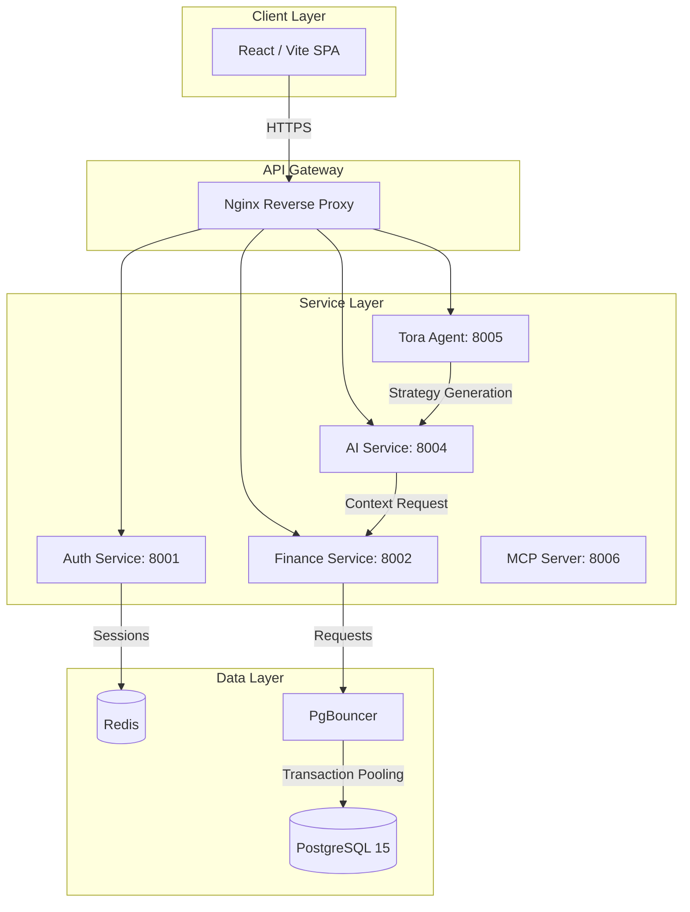

# Spendsy: Architecture & Requirements

This document describes the high-level architecture of the Spendsy platform, its core requirements (SRS), and the technical breakdown of its services.

---

## 📱 System Overview

Spendsy is built as a set of distributed microservices that communicate via high-performance REST APIs. It follows a modern **Microservices Architecture**, decoupled by domain and secured by an Nginx Gateway.

### 🏗️ Component Diagram

---

## 🎯 Core Requirements (SRS)

### 1. Automated Financial Tracking
- **Smart Parsing**: 100% accurate deterministic extraction from digital PDFs using coordinate-based analysis.
- **Fingerprinting**: SHA-256 deduplication to prevent double-counting transactions.
- **Wealth Monitoring**: Unified tracking of assets (Gold, Equity) and liabilities (Loans).

### 2. TORA Intelligence 2.0
- **Natural Language Querying**: High-fidelity intent resolution (98.3% recall) using a 4-stage fuzzy resolver.
- **Universal Intelligence**: Live market data from 12 plugin categories (Gold, Forex, Investments).
- **Persistent Vault**: Long-term memory stored in a local **Obsidian Vault**.
- **Structural Awareness**: Uses **Graphify** to navigate codebase logic with minimal token usage.

### 3. Security & Reliability
- **Auth**: HttpOnly cookie-based JWT with instant Redis revocation.
- **Integrity**: Absolute financial accuracy enforced by Python `Decimal` type.
- **Resilience**: Transaction-mode pooling via PgBouncer and `tenacity` retries.

---

## 🛠️ Service Breakdown

### 1. Auth Service (`backend/auth-service`)
- **Tech**: FastAPI, SQLAlchemy, Redis.
- **Role**: Identity management, JWT issuance, and session invalidation.

### 2. Finance Service (`backend/finance-service`)
- **Tech**: FastAPI, PostgreSQL, `pdfplumber`.
- **Role**: Core ledger, bank account management, and deterministic PDF parsing.
- **Key Logic**: Uses hashing of {user, date, amount, title} to manage statement overlaps.

### 3. AI Service & Tora (`backend/spendsy-ai`)
- **Tech**: FastAPI, Gemini 1.5 Pro, local Ollama (Gemma 4 E2B).
- **Resolver**: 4-stage entity resolution: **Exact → Synonym → Fuzzy → Fallback**.
- **Memory**: Synchronizes all goals and plans to a local Markdown vault.

### 4. Nginx Gateway (`infra/docker/nginx.conf`)
- Entry point for all traffic. Handles path-based routing (`/auth`, `/finance`, etc.) and header standardization.

---

## 📊 CRUD & Data Mapping

| Entity | Service | Storage |
| :--- | :--- | :--- |
| **User** | Auth | PostgreSQL (`auth_user`) |
| **Transaction** | Finance | PostgreSQL (`finance_transaction`) |
| **Wealth Item** | Finance | PostgreSQL (`finance_wealth`) |
| **Plan/Goal** | AI | Obsidian Vault (.md) |
| **Sessions** | Auth | Redis |

---

*For the legacy deep-dive analysis including full API routes, see the archived `ARCHITECTURAL_ANALYSIS.md`.*
